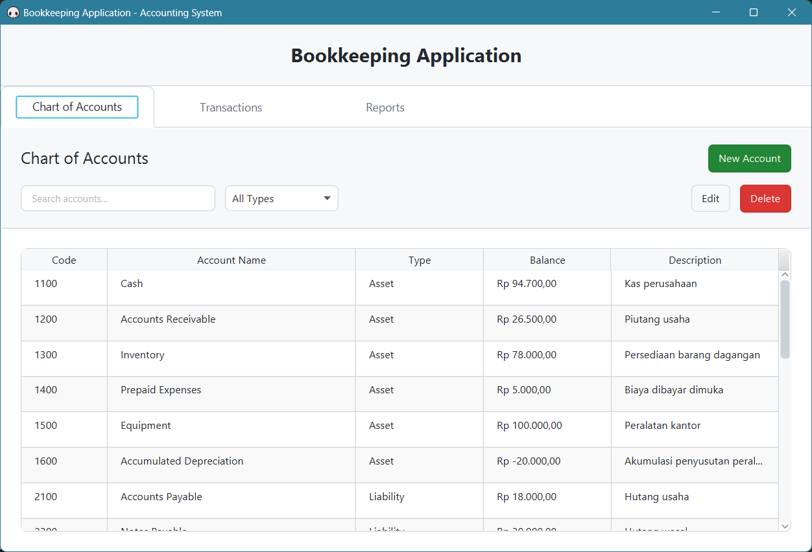
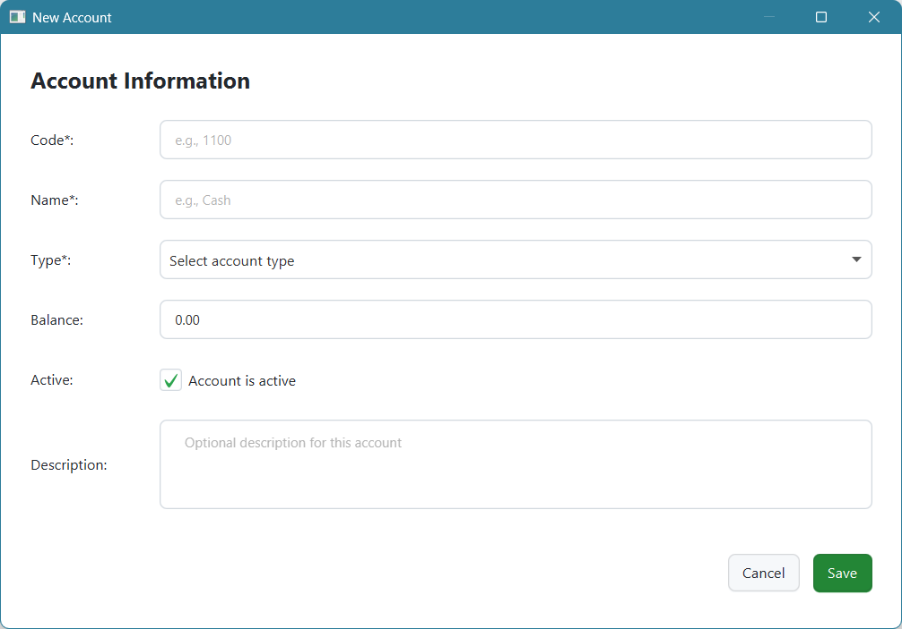
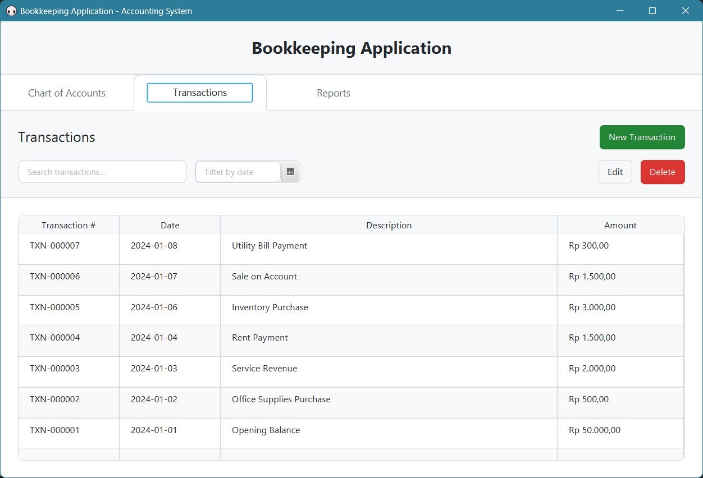
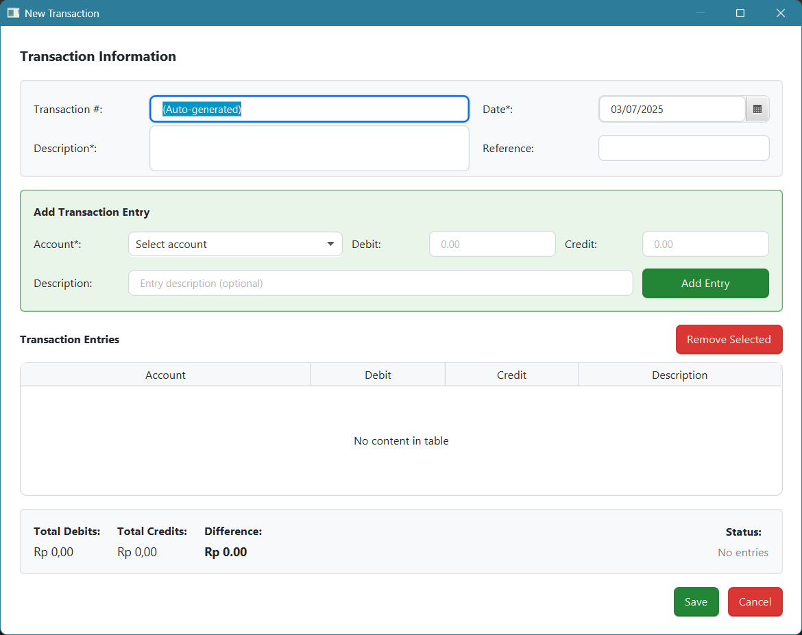
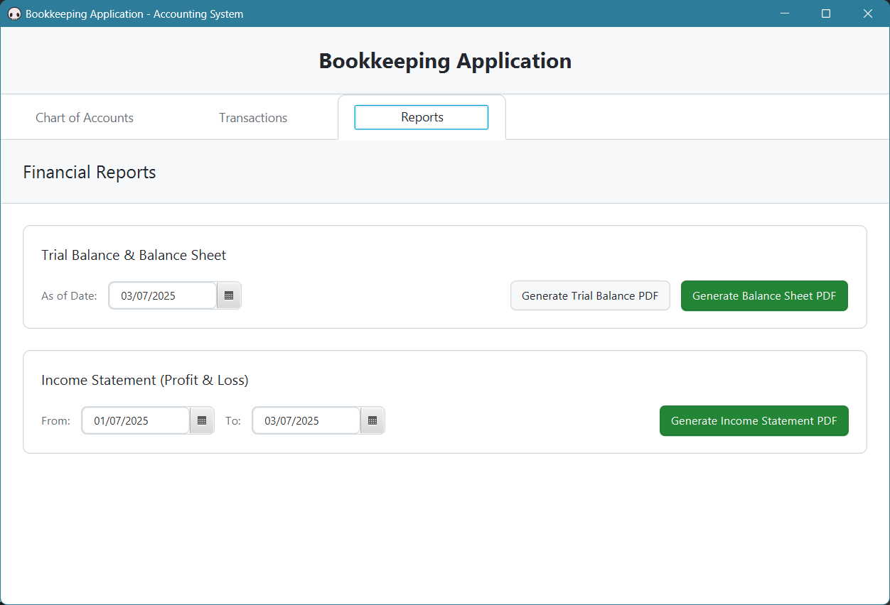

# Bookkeeping Application## 🚀 Quick Start

1. **Prerequisites**: Java 21, Maven 3.6+, JavaFX SDK 21
2. **Setup**: Extract JavaFX SDK ke `C:\Java\javafx-sdk-21.0.7\`
3. **Run**: `mvn clean javafx:run`
4. **Import Data**: `import-data.bat` untuk import accounts & transactions dari CSVplete Accounting System

    

Sistem akunting lengkap yang dibangun dengan JavaFX, Maven, SQLite, JPA, dan Hibernate. Aplikasi ini menyediakan fitur Chart of Accounts (CoA), manajemen transaksi, laporan keuangan dalam format PDF, dan bulk import data dari CSV.

**🎯 Features**: Double-Entry Bookkeeping • Chart of Accounts • Financial Reports • CSV Import • Modern UI

## � Table of Contents

- [🚀 Quick Start](#-quick-start)
- [👀 Application Preview](#-application-preview)
- [✨ Fitur Utama](#fitur-utama)
- [📸 Dokumentasi GUI Application](#-dokumentasi-gui-application)
- [🔧 Teknologi yang Digunakan](#teknologi-yang-digunakan)
- [📥 Data Import System](#-data-import-system)
- [🔄 Visual Application Workflow](#-visual-application-workflow)
- [📊 Struktur Database](#struktur-database)
- [🏗️ Instalasi dan Setup](#instalasi-dan-menjalankan-aplikasi)
- [📚 Usage Guide](#usage-guide)
- [🔧 Troubleshooting & Debugging](#-troubleshooting--debugging)
- [🏗️ Architecture & Technical Details](#️-architecture--technical-details)
- [🤝 Contributing](#-contributing)
- [🎯 Quick Reference](#-quick-reference)

## �🚀 Quick Start

1. **Prerequisites**: Java 21, Maven 3.6+, JavaFX SDK 21
2. **Setup**: Extract JavaFX SDK ke `C:\Java\javafx-sdk-21.0.7\`
3. **Run**: `run.bat` atau `mvn clean javafx:run`
4. **Import Data**: `import-data.bat` untuk import accounts & transactions dari CSV

## 👀 Application Preview


*Modern, clean interface dengan complete accounting functionality*

## Fitur Utama

### 📊 Chart of Accounts (CoA)
- Manajemen akun dengan kode, nama, tipe, dan deskripsi
- Support untuk semua tipe akun: Asset, Liability, Equity, Revenue, Expense, Cost of Goods Sold
- CRUD operations lengkap untuk akun
- Filter dan pencarian akun
- Default Chart of Accounts siap pakai
- **Bulk import dari CSV file**

### 💼 Manajemen Transaksi
- Double-entry bookkeeping system
- Validasi otomatis untuk transaksi yang balance
- Support multiple entries per transaksi
- Pencarian dan filter transaksi berdasarkan tanggal dan deskripsi
- Auto-generated transaction numbers
- **Bulk import dari CSV file**

### 📈 Laporan Keuangan
- **Trial Balance** - Ringkasan semua akun dengan saldo debit/credit
- **Balance Sheet** - Laporan posisi keuangan (Asset, Liability, Equity)
- **Income Statement (P&L)** - Laporan laba rugi dengan periode tertentu
- Export ke PDF untuk semua laporan
- Format laporan yang profesional

### 🎨 User Interface
- Design minimalist dengan GitHub Light theme
- Interface yang clean dan mudah digunakan
- Responsive layout dan resizable dialogs
- Intuitive navigation dengan tab-based interface

### 📥 Data Import/Export
- **CSV Import** untuk accounts dan transactions
- **Batch processing** dengan validation
- **Debug tools** untuk troubleshooting import
- **Sample data** files included

## 📸 Dokumentasi GUI Application

### 🏠 Main Dashboard

*Tampilan utama aplikasi dengan tab navigation untuk Chart of Accounts, Transactions, dan Reports*

### 📊 Chart of Accounts Management

*Dialog untuk menambah/edit akun baru dengan validasi tipe akun dan format input yang user-friendly*

### 💼 Transaction Management

*View daftar transaksi dengan fitur filter, search, dan pagination untuk manajemen transaksi yang efisien*

### ➕ Create New Transaction

*Dialog pembuatan transaksi baru dengan sistem double-entry bookkeeping dan validasi balance otomatis*

### 📈 Financial Reports

*Section laporan keuangan dengan Trial Balance, Balance Sheet, dan Income Statement yang dapat diekspor ke PDF*

### ✨ Key GUI Features:
- **🎨 Modern Design**: Clean, minimalist interface dengan GitHub Light theme
- **📱 Responsive**: Semua dialog dapat di-resize dan responsive terhadap ukuran layar
- **🔍 Smart Search**: Filter dan pencarian real-time di semua tabel
- **⚡ Fast Navigation**: Tab-based interface untuk akses cepat ke semua fitur
- **✅ Input Validation**: Real-time validation untuk semua form input
- **🎯 User-Friendly**: Intuitive workflow untuk accounting operations

## Teknologi yang Digunakan

- **JavaFX 21** - Framework UI
- **Maven** - Build tool dan dependency management
- **SQLite** - Database ringan untuk penyimpanan data
- **JPA (Jakarta Persistence API)** - ORM specification
- **Hibernate 6.4** - JPA implementation dengan lazy loading fix
- **iText 5.5** - PDF generation
- **Java 21** - Programming language

## 📥 Data Import System

### Account Import

Create an `accounts.csv` file with format:
```csv
code,name,type,balance,active,description
1100,Cash,ASSET,50000.00,true,Company cash
1200,Accounts Receivable,ASSET,25000.00,true,Money owed by customers
2100,Accounts Payable,LIABILITY,15000.00,true,Money owed to suppliers
3100,Owner's Capital,EQUITY,150000.00,true,Initial investment
4100,Sales Revenue,REVENUE,0.00,true,Revenue from sales
5100,Salaries Expense,EXPENSE,0.00,true,Employee salaries
6100,Cost of Goods Sold,COST_OF_GOODS_SOLD,0.00,true,Cost of inventory sold
```

**Account Types**: `ASSET`, `LIABILITY`, `EQUITY`, `REVENUE`, `EXPENSE`, `COST_OF_GOODS_SOLD`

### Transaction Import

Create a `transactions.csv` file with format:
```csv
date,description,reference,account_code,debit_amount,credit_amount,entry_description
2024-01-01,Opening Balance,REF001,1100,50000.00,0.00,Starting cash balance
2024-01-01,Opening Balance,REF001,3100,0.00,50000.00,Initial capital investment
2024-01-02,Office Supplies,REF002,5400,500.00,0.00,Purchase office supplies
2024-01-02,Office Supplies,REF002,1100,0.00,500.00,Cash payment for supplies
```

**Note**: Each transaction requires multiple rows - one for each account involved.

### Import Commands

```bash
# Import everything
import-data.bat

# Import individually
mvn exec:java -Dexec.mainClass="com.bookkeeping.util.DataImporter" -Dexec.args="accounts"
mvn exec:java -Dexec.mainClass="com.bookkeeping.util.DataImporter" -Dexec.args="transactions"

# Test database content
mvn exec:java -Dexec.mainClass="com.bookkeeping.util.DataImporter" -Dexec.args="test"

# Debug full import process
debug-import.bat
```

### Import Workflow

1. **Clear existing data** (optional): `clear-data.bat`
2. **Import accounts first**: Must be done before transactions
3. **Import transactions**: References account codes from accounts.csv
4. **Restart GUI app**: To see imported data (or start app after import)

## 🔄 Visual Application Workflow

### Step 1: Main Dashboard

**Start** → Launch aplikasi → **Navigate** menggunakan tabs

### Step 2: Account Management

**Create** → Add new accounts → **Manage** Chart of Accounts

### Step 3: Transaction Processing

**View** → Browse transactions → **Filter** by date/description


**Create** → New transaction → **Balance** debit/credit entries

### Step 4: Financial Reporting

**Generate** → Financial reports → **Export** to PDF

**🎯 Complete Workflow**: Account Setup → Transaction Entry → Report Generation

## Struktur Database

### Tabel `accounts`
```sql
- id (Primary Key)
- account_code (Unique)
- account_name
- account_type (ASSET, LIABILITY, EQUITY, REVENUE, EXPENSE, COST_OF_GOODS_SOLD)
- parent_id
- balance
- description
- is_active
```

### Tabel `transactions`
```sql
- id (Primary Key)
- transaction_number (Unique)
- transaction_date
- description
- reference
- total_amount
- created_at
- updated_at
```

### Tabel `transaction_entries`
```sql
- id (Primary Key)
- transaction_id (Foreign Key)
- account_id (Foreign Key)
- debit_amount
- credit_amount
- description
```

## Instalasi dan Menjalankan Aplikasi

### Prerequisites
1. **Java 21** atau lebih tinggi
2. **Maven 3.6** atau lebih tinggi
3. **JavaFX SDK 21** - Download dari [OpenJFX](https://openjfx.io/)

### Langkah Instalasi

1. **Clone atau download project ini**

2. **Setup JavaFX SDK**
   - Extract JavaFX SDK ke `C:\Java\javafx-sdk-21.0.7\`
   - Atau sesuaikan path di `pom.xml`

3. **Compile project**
   ```bash
   mvn clean compile
   ```

4. **Jalankan aplikasi**
   ```bash
   mvn clean javafx:run
   ```

### Getting Started

1. Jalankan aplikasi pertama kali - database akan dibuat otomatis
2. Mulai dengan membuat Chart of Accounts (CoA) sesuai kebutuhan bisnis
3. Tambahkan transaksi sesuai aktivitas bisnis
4. Generate laporan keuangan (Trial Balance, Balance Sheet, Income Statement)

### Commands Berguna

```bash
# Clear all data (delete database)
clear-data.bat

# Compile only
mvn clean compile

# Run application
mvn clean javafx:run
```

## Penggunaan Aplikasi

### 1. Chart of Accounts

- Buka tab "**Chart of Accounts**" (lihat screenshot di atas)
- Klik "**New Account**" untuk menambah akun baru
- Double-click pada akun untuk mengedit
- Gunakan filter untuk mencari akun berdasarkan tipe atau nama
- **Dialog Creation**: 

### 2. Transaksi

- Buka tab "**Transactions**" (lihat screenshot di atas)
- Klik "**New Transaction**" untuk membuat transaksi baru
- Isi informasi transaksi (tanggal, deskripsi, referensi)
- Tambahkan entries dengan memilih akun dan amount (debit atau credit)
- Pastikan total debit = total credit sebelum save
- **Dialog Creation**: 

### 3. Laporan

- Buka tab "**Reports**" (lihat screenshot di atas)
- Pilih tanggal untuk Trial Balance dan Balance Sheet
- Pilih periode untuk Income Statement
- Klik tombol generate untuk menghasilkan PDF
- **Output**: File PDF akan tersimpan di folder project

## Default Chart of Accounts

Aplikasi sudah dilengkapi dengan Chart of Accounts default:

**ASSETS (1000-1999)**
- 1100 - Cash
- 1200 - Accounts Receivable
- 1300 - Inventory
- 1400 - Prepaid Expenses
- 1510 - Equipment
- 1530 - Vehicles

**LIABILITIES (2000-2999)**
- 2100 - Accounts Payable
- 2200 - Accrued Expenses
- 2300 - Unearned Revenue
- 2510 - Bank Loan

**EQUITY (3000-3999)**
- 3100 - Capital
- 3200 - Retained Earnings
- 3300 - Owner's Drawings

**REVENUE (4000-4999)**
- 4100 - Sales Revenue
- 4200 - Service Revenue
- 4300 - Other Income

**EXPENSES (5000-5999)**
- 5100 - Salaries Expense
- 5200 - Rent Expense
- 5300 - Utilities Expense
- 5400 - Office Supplies Expense
- 5500 - Depreciation Expense

**COST OF GOODS SOLD (6000-6999)**
- 6100 - Purchases
- 6200 - Freight In

## 🔧 Troubleshooting & Debugging

### Common Issues

#### ❌ LazyInitializationException when editing transactions
**Problem**: `failed to lazily initialize a collection of role: com.bookkeeping.entity.Transaction.entries`

**Solution**: ✅ **FIXED** - All TransactionDAO queries now use `LEFT JOIN FETCH t.entries` to eagerly load transaction entries.

**Details**: This issue occurred when the GUI tried to access transaction entries outside of an active Hibernate session. Fixed by updating all query methods in TransactionDAO.java.

#### ❌ Import data doesn't show in GUI
**Problem**: CSV import completes successfully but data doesn't appear in the application.

**Solutions**:
1. ✅ **Restart the GUI app** after importing data
2. ✅ Check account types match exactly: `ASSET`, `LIABILITY`, `EQUITY`, `REVENUE`, `EXPENSE`, `COST_OF_GOODS_SOLD`
3. ✅ Import accounts before transactions
4. ✅ Verify CSV format matches examples

#### ❌ Module not found error
**Problem**: JavaFX modules not found when running application.

**Solutions**:
- Download JavaFX SDK 21 from [OpenJFX](https://openjfx.io/)
- Extract to `C:\Java\javafx-sdk-21.0.7\`
- Update path in `run.bat` if different location
- Ensure Maven uses Java 21

#### ❌ Database errors
**Problem**: Database connection or schema issues.

**Solutions**:
- Delete `bookkeeping.db` file and restart app (will recreate database)
- Check file permissions in project directory
- Ensure SQLite driver is in classpath (handled by Maven)

#### ❌ PDF generation errors
**Problem**: Cannot generate PDF reports.

**Solutions**:
- Check write permissions in project directory
- Close any open PDF files with same name
- Ensure iText library is properly loaded (Maven dependency)

### 🐛 Debugging Data Import

#### Test Database Content
```bash
# Check what's actually in the database
mvn exec:java -Dexec.mainClass="com.bookkeeping.util.DataImporter" -Dexec.args="test"
```

#### Debug Import Process
```bash
# Run comprehensive import debugging
debug-import.bat

# Or step-by-step:
mvn exec:java -Dexec.mainClass="com.bookkeeping.util.DataImporter" -Dexec.args="accounts"
mvn exec:java -Dexec.mainClass="com.bookkeeping.util.DataImporter" -Dexec.args="test"
mvn exec:java -Dexec.mainClass="com.bookkeeping.util.DataImporter" -Dexec.args="transactions"
mvn exec:java -Dexec.mainClass="com.bookkeeping.util.DataImporter" -Dexec.args="test"
```

#### Clear and Reset Data
```bash
# Clear all data and start fresh
clear-data.bat

# Then reimport
import-data.bat
```

### 📋 Import Validation Checklist

#### Accounts CSV (`accounts.csv`)
- ✅ Header row: `code,name,type,balance,active,description`
- ✅ Account codes are unique
- ✅ Account types are: `ASSET`, `LIABILITY`, `EQUITY`, `REVENUE`, `EXPENSE`, `COST_OF_GOODS_SOLD`
- ✅ Balance is decimal number (e.g., `1000.00`)
- ✅ Active is `true` or `false`
- ✅ No empty required fields

#### Transactions CSV (`transactions.csv`)
- ✅ Header row: `date,description,reference,account_code,debit_amount,credit_amount,entry_description`
- ✅ Date format: `YYYY-MM-DD`
- ✅ Account codes exist in accounts.csv
- ✅ Either debit_amount OR credit_amount (not both)
- ✅ Use `0.00` for unused amount column
- ✅ Same reference number for related entries
- ✅ Transaction balances (total debits = total credits per reference)

### 📊 Sample Data Verification

#### Expected Import Results
After running `import-data.bat` with sample data:
- **Accounts**: ~23 accounts imported
- **Transactions**: ~8-10 transactions imported
- **Database size**: ~50-100 KB

#### Verify Import Success
```bash
# Should show accounts and transactions
mvn exec:java -Dexec.mainClass="com.bookkeeping.util.DataImporter" -Dexec.args="test"
```

Expected output:
```
=== DATABASE CONTENT TEST ===
Total accounts in database: 45 (includes 23 imported + 22 default)
Total transactions in database: 8
```

### 🚀 Performance Notes

#### Database Optimization
- ✅ Eager loading prevents N+1 queries
- ✅ Indexed foreign keys for fast lookups
- ✅ Connection pooling handled by Hibernate
- ✅ SQLite optimized for single-user desktop app

#### Memory Usage
- Typical usage: 100-200 MB RAM
- Large datasets (1000+ transactions): 300-500 MB RAM
- PDF generation: Additional 50-100 MB temporarily

### 🔍 Advanced Debugging

#### Enable Hibernate SQL Logging
Add to `persistence.xml` (for development):
```xml
<property name="hibernate.show_sql" value="true"/>
<property name="hibernate.format_sql" value="true"/>
```

#### Check File Locks
If database access fails:
```bash
# Check if database file is locked
lsof bookkeeping.db  # Linux/Mac
handle -u bookkeeping.db  # Windows
```

#### Maven Dependency Issues
```bash
# Clean and rebuild everything
mvn clean install -U

# Check dependency tree
mvn dependency:tree
```

## 🏗️ Architecture & Technical Details

### Project Structure
```
src/main/java/
├── com.bookkeeping/
│   ├── BookkeepingApplication.java     # Main JavaFX application
│   ├── controller/                     # UI controllers
│   │   ├── MainController.java         # Main window controller
│   │   ├── AccountDialogController.java
│   │   └── TransactionDialogController.java
│   ├── dao/                           # Data Access Objects
│   │   ├── AccountDAO.java            # Account database operations
│   │   ├── TransactionDAO.java        # Transaction database operations
│   │   └── TransactionEntryDAO.java   # Transaction entry operations
│   ├── entity/                        # JPA entities
│   │   ├── Account.java               # Account entity
│   │   ├── Transaction.java           # Transaction entity
│   │   ├── TransactionEntry.java      # Transaction entry entity
│   │   └── AccountType.java           # Account type enum
│   ├── service/                       # Business logic
│   │   ├── AccountService.java        # Account business logic
│   │   ├── TransactionService.java    # Transaction business logic
│   │   ├── ReportService.java         # Report generation
│   │   └── PDFReportService.java      # PDF export
│   ├── model/                         # Data models for reports
│   └── util/                          # Utilities
│       ├── DatabaseUtil.java          # Database connection
│       └── DataImporter.java          # CSV import utility
```

### Database Schema
- **SQLite** database with **JPA/Hibernate** ORM
- **Automatic schema generation** from entities
- **Foreign key constraints** enforced
- **Lazy loading** with eager fetch strategies where needed

### Build & Dependencies
- **Maven** for dependency management
- **JavaFX Maven Plugin** for running application
- **Hibernate 6.4** for ORM
- **iText 5.5** for PDF generation
- **SQLite JDBC** for database connectivity

## 🔄 Recent Updates & Fixes

### ✅ Version 2.0 - Enhanced Import & UI
- **Fixed LazyInitializationException** in transaction editing
- **Added bulk CSV import** for accounts and transactions
- **Modernized UI** with GitHub Light theme
- **Made dialogs resizable** and responsive
- **Removed sample data dependencies**
- **Added comprehensive debugging tools**

### 🐛 Bug Fixes
1. **LazyInitializationException**: Fixed by eager loading with `LEFT JOIN FETCH`
2. **Account type validation**: Corrected enum values in CSV import
3. **Dialog sizing**: Made all dialogs resizable with proper minimum sizes
4. **CSS conflicts**: Removed inline styles, using CSS classes only
5. **Import validation**: Added proper error handling and validation

### 🆕 New Features
1. **CSV Import System**: Bulk import accounts and transactions
2. **Debug Tools**: Database content verification and import testing
3. **Batch Scripts**: Automated import and data clearing utilities
4. **Enhanced UI**: Modern, clean interface with better UX
5. **Documentation**: Comprehensive README with troubleshooting

## 🤝 Contributing

### Development Setup
1. Fork this repository
2. Clone your fork locally
3. Set up JavaFX SDK as described in installation
4. Make your changes
5. Test thoroughly (especially import/export features)
6. Submit a pull request

### Coding Standards
- **Java 21** features encouraged
- **JavaFX best practices** for UI code
- **JPA/Hibernate** for all database operations
- **Maven** for dependency management
- **Comprehensive error handling**
- **Clear, descriptive method names**

### Testing
- Test all CRUD operations
- Verify CSV import/export functionality
- Check PDF generation
- Validate UI responsiveness
- Test error scenarios

## 📄 License

**MIT License** - Feel free to use for commercial or non-commercial purposes.

```
Copyright (c) 2025 Bookkeeping Application

Permission is hereby granted, free of charge, to any person obtaining a copy
of this software and associated documentation files (the "Software"), to deal
in the Software without restriction, including without limitation the rights
to use, copy, modify, merge, publish, distribute, sublicense, and/or sell
copies of the Software, and to permit persons to whom the Software is
furnished to do so, subject to the following conditions:

The above copyright notice and this permission notice shall be included in all
copies or substantial portions of the Software.

THE SOFTWARE IS PROVIDED "AS IS", WITHOUT WARRANTY OF ANY KIND, EXPRESS OR
IMPLIED, INCLUDING BUT NOT LIMITED TO THE WARRANTIES OF MERCHANTABILITY,
FITNESS FOR A PARTICULAR PURPOSE AND NONINFRINGEMENT.
```

---

## 🎯 Quick Reference

### Essential Commands
```bash
# Start application
mvn clean javafx:run

# Import sample data
import-data.bat

# Clear all data
clear-data.bat

# Debug import
debug-import.bat

# Test database
mvn exec:java -Dexec.mainClass="com.bookkeeping.util.DataImporter" -Dexec.args="test"
```

### File Locations
- **Database**: `bookkeeping.db` (auto-created)
- **Sample CSVs**: `accounts.csv`, `transactions.csv`
- **Reports**: Generated in project root directory
- **Logs**: Console output (redirect with `> output.log`)

---

**🎉 Happy Accounting! 📊💼**

*Built with ❤️ using JavaFX, Maven, and modern Java development practices.*
